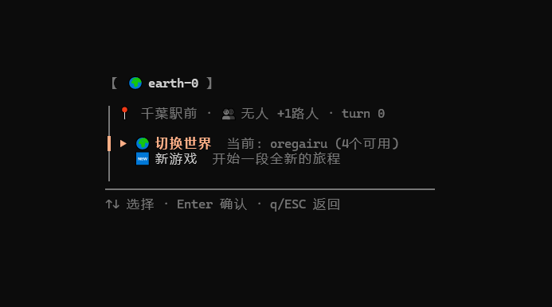
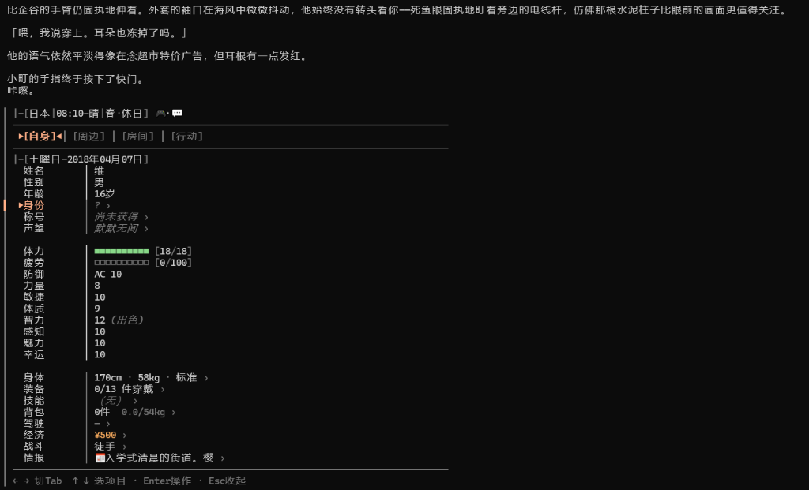
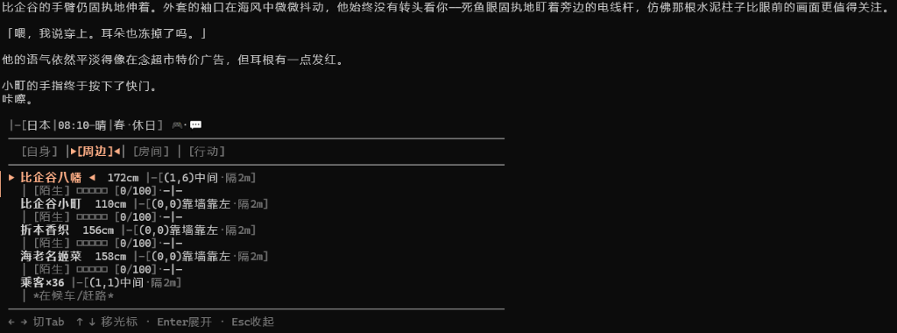
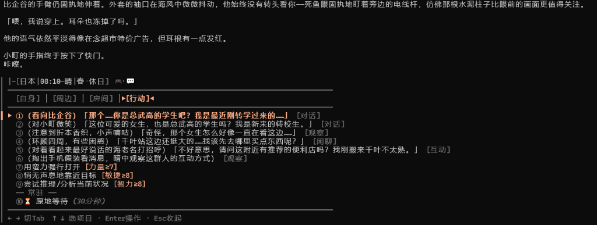

# earth-0

**A general-purpose deterministic engine + decoupled multi-agent runtime for interactive fiction.**
NPC simulation runs via isolated, on-demand LLM invocations with their own memory and knowledge.
The engine owns the physics, LLMs own the stories.

The engine handles physics — time, space, combat, economy, schedules.
LLMs handle narrative — but the engine won't let them cheat.

> Read [`docs/PHILOSOPHY.md`](docs/PHILOSOPHY.md) before touching the code.

---

<p align="center">
  
</p>

<h3 align="center">🎮 TUI 游戏界面与 TRPG 机制展示</h3>

<p align="center">
  
  &nbsp;
  
</p>

<p align="center">
  
</p>

---

## 这是什么 / What

A modular interactive fiction runtime built on [pi-coding-agent](https://github.com/mariozechner/pi-coding-agent).
Not a character card. Not a prompt chain. A full deterministic engine backed by LLM-driven NPC Agents.

**The problem with normal LLM roleplay:**
- You steal an item — the LLM says you did, but no item moved. So you can steal it again.
- You're in a "room" with NPCs — but there's no grid, no walls, no physics.
- NPCs only exist when mentioned — no schedules, no independent movement.
- The GM puppets everyone, so every NPC already "knows" what every other NPC thinks.

**earth-0 fixes all of this.** The engine enforces conservation laws (money, items, HP, time, position, information visibility).
Everything else — atmosphere, dialogue, psychology — is handed to LLMs.

> 终端里的活着的小说。引擎算数字，LLM 写小说。

---

## 这是什么

一个运行在 [pi-coding-agent](https://github.com/mariozechner/pi-coding-agent) 框架上、**完全与题材解耦的通用交互式叙事沙盒引擎**。

它本身并不绑定任何特定的故事剧本。通过定义不同的 **世界数据包 (Worldpack)**（配置角色卡、物品、地图、时间线等），任何人都可以使用它轻松制作出属于自己的 AI 跑团和文字 RPG 游戏。

它包含了一整套完整的确定性规则系统（时间轴、战斗数值、经济系统、物理空间网格、日程安排、动态天气、剧情分支时间线），配合一个 LLM 驱动的虚拟游戏主持人（GM）。

### 不是 AI 聊天机器人

普通 LLM 角色扮演的问题是：
- **物品虚空生成**：你偷了一件东西，LLM 说你偷了，但下次你又能偷——因为没有“物品所有权转移”的事实落盘。
- **空间无限膨胀**：你和 NPC 在一个“房间”里，但这个房间可以挤下所有人——因为没有物理坐标和容纳上限。
- **NPC 离线即死**：NPC 只在与玩家对话时才“存在”，你不理他们时他们就是静止的——因为没有自动运作的日程与行为系统。
- **上帝视角**：GM 一个人扮演所有 NPC，所以每个 NPC 说话时实际上已经“偷看”了其他 NPC 的内心活动——因为缺乏信息物理隔离。

earth-0 解决的就是这些问题。**引擎不让 LLM 偷懒。** 偷东西必须走 `steal_item` 接口（引擎执行真背包扣除），进房间必须分配棋盘格坐标（物理撞墙拦截），NPC 按照自己的日程表在地图上自主移动，每个 NPC 采用**“临时演员制”在回合中并行派生出独立的心智上下文（独立 LLM 调用）**，确保对话时拥有真实的信息差与误判。

### 📳 移动终端友好与极致能耗设计 (Mobile-First & Low Footprint)

本项目在立项之初就将“在手机终端直接游玩”作为核心技术约束，避免让其退化为只能在昂贵服务器或云端运行的臃肿软件：
- **手机 TUI 适配**：纯文本终端 UI 设计，无缝适配手机 Termux、SSH 客户端等移动终端环境，提供纯粹、轻量、极客的移动端“文字沙盒”游玩体验。
- **临时演员制 (On-Demand Spawning)**：NPC 智能体不常驻后台进程，仅在玩家同室交互时动态派生（每回合仅生成 2~5 个 NPC 实例），这使每回合的 Token 预算和性能消耗不随世界 NPC 总数膨胀，将单轮 API 成本和资源开销压缩至极低。

---

## 核心原则

```
引擎守恒，叙事自由
```

引擎只拦截不可逆的守恒量（金钱、物品、HP、时间、位置、信息可见性）。其余一切——氛围、对话、心理描写、价格高低——全权交给 LLM。

**引擎不该替 LLM 做叙事判断。** 引擎负责减负和防偷懒，不限制创造力。

---

## 架构：四阶段 + 裸 stream 渲染

每个回合走四个引擎阶段。Phase 1-2 静默，Phase 3 裸 stream 渲染（物理零工具），Phase 4 可选。

```
玩家输入
    ↓
┌───────────────────────────────────────────┐
│ Phase 1 — 分类 + 工具执行（静默）          │
│  LLM 输出 JSON → 引擎解析 → 调工具         │
│  JSON 失败 → 关键词回落 → 引擎兜底         │
│  同时预取描写信息给 Phase 3                │
├───────────────────────────────────────────┤
│ Phase 2 — NPC Agent（并行，静默）          │
│  引擎自动检测同场 NPC → spawn 独立 LLM     │
│  每人只拿自己的记忆+印象+身体状态           │
│  输出独立的 [NPC名] 回应文本               │
├───────────────────────────────────────────┤
│ 交互检测（Phase 2.5）                      │
│  LLM mini-judge：每个 NPC 在 cue 玩家吗？  │
│  沉默 NPC → 保持 novel，不强制 turn_based  │
│  GAL 场景边界：一对一+亲密→自动第一人称     │
├───────────────────────────────────────────┤
│ Phase 3 — 裸 stream 渲染（零工具，面向玩家）│
│  generateCompletion → 直接调 API           │
│  物理上无 tool definitions                 │
│  NPC 台词原文引用，渲染 LLM 不改写          │
│  Lint + retry（最多 3 次）                 │
├───────────────────────────────────────────┤
│ Phase 4 — 创意层（可选，best-effort）       │
└───────────────────────────────────────────┘
```

详细架构见 [`docs/decisions.md`](docs/decisions.md) #16 和 [`docs/PHILOSOPHY.md`](docs/PHILOSOPHY.md) §2。

---

## 它能做什么

### 世界模拟（"世界在转"）

| 系统 | 说明 |
|------|------|
| 🕐 **时间** | 分钟级推进 + 跨天结算 + NPC 年龄/人生阶段同步 |
| 🗺️ **物理空间** | 区域→建筑→楼层→房间，棋盘坐标 + 家具放置，走到尽头撞墙 |
| 🚶 **NPC 日程** | 每个 NPC 有日程模板，按年龄段和星期自动移动。玩家不互动他们也在过日子 |
| 🌤️ **天气** | 马尔可夫链季节转移 + 温度模型 + 疲劳乘数 |
| 📅 **日历** | 日期触发事件 + 预热/当天/余波三阶段，文化祭当天 NPC 自动去操场 |
| 📱 **手机/SNS** | 消息、联系人、通话记录、BBS、SNS 时间线、照片 |

### 角色深度

| 特性 | 说明 |
|------|------|
| 🎭 **心智隔离的 NPC 模拟** | 每个 NPC 在对话中派生独立的 LLM 上下文，仅基于自身的记忆、对外印象及状态响应，实现天然的社交信息差 |
| 💬 **内心独白 + 言行** | NPC 嘴上说的和心里想的可以完全相反。嘴上嘴硬，内心写"我怕被拒绝" |
| 🧬 **身体系统** | 多年龄段体型发育、服装集（5 套可切换）、生理状态引擎 |
| 🧠 **信息分级** | 角色常识按关系程度可见——陌生人只看 common 级，至交看到 intimate 级 |

### 叙事引擎

| 特性 | 说明 |
|------|------|
| 📜 **剧情时间线** | 49 个 JSON 事件 + 触发条件（年龄、地点、好感度、flag），每回合自动扫描 |
| 🪝 **剧情钩子** | 引擎和 LLM 都可以创建钩子，最多同时 3 个，有过期机制 |
| 🔒 **秘密防火墙** | 四级可见性 + `reveal_secret` 工具 + reveal 日志 |
| ✍️ **正文质量门** | 渲染后机器扫描硬伤（好感度数值泄露、伪菜单结尾、废话开头），命中自动让模型重写 |
| 🎭 **叙事视角系统** | LLM mini-judge 精确检测哪些 NPC 在 cue 玩家；沉默 NPC 不打断小说流；GAL 第一人称场景边界锁（一对一+亲密→自动触发）；关系突变/剧情触发时播放只读幕间（他者之眼/宏大故事），完美展现信息差与世界反应 |
| 🔒 **结构性隔离** | Phase 3 渲染 LLM 走裸 stream（`generateCompletion`），物理上无工具列表——无法跳过结算或调用写工具。不靠 prompt 软约束，靠架构硬隔离 |


### 开放式世界

| 特性 | 说明 |
|------|------|
| 👤 **运行时创建角色** | `create_character` 支持预制角色的完整字段（性格阶段、说话风格、日程、驱动力等） |
| 🏗️ **运行时创建地点** | `create_location` + 家具系统 |
| 🎭 **临时 NPC** | `spawn_temp_npc` 创建只活在当前场景的角色（混混、醉汉、星探），场景结束自动回收。有潜力就 `instantiate_npc` 转正 |
| 🔄 **多世界包** | 换个世界观只需改一个文件。现成：oregairu（春物）, wasteland（开发中） |

### 🌐 关于 Web 前端与页面扩展

本引擎目前专注于打造纯文本、高鲁棒性的终端运行核心（TUI）。虽然我们的长期路线图包含开发 Web 可视化前端，但现阶段为了保持底层逻辑与测试覆盖的精纯度，我们优先将精力集中于终端引擎。
- **推荐前端合作项目**：如果你希望在现阶段为本引擎制作 Web 页面或开发可视化前端，强烈推荐参考或结合 [tavernlike](https://github.com/ariespo/tavernlike) 项目。它提供了与本引擎架构高度契合的网页端对话与 UI 渲染思路。

---

## 快速开始

```bash
# 前置：安装 pi-coding-agent 框架
# 参考 https://github.com/mariozechner/pi-coding-agent

# 克隆并启动
cd earth-0
bash start.sh

# 跑测试（不需要 LLM，2 秒完成）
npx tsx test.ts
```

**配置模型**：编辑 `data/rendering.json`：
```json
{
  "model_mappings": {
    "logic_engine_model": "deepseek/deepseek-v4-pro",
    "narrative_render_model": "deepseek/deepseek-v4-pro",
    "npc_agent_model": "deepseek/deepseek-v4-flash"
  }
}
```

---

## 常用 TUI 命令

首次进入游戏后，GM 会输出新手指南。以下为常用终端命令速查：

| 分类 | 命令 | 说明 |
|------|------|------|
| 🧭 状态 | `/status` | 属性、HP、疲劳、装备、称号 |
| | `/bag` | 查看背包与随身物品 |
| | `/look` | 观察周围——NPC、家具、出口 |
| | `/room` | 当前房间的网格地图 |
| 🚶 移动 | `/go` | 旅行——区域→建筑→楼层→房间 |
| | `/goskip` | 直接传送到已知地点 |
| 📅 时间 | `/sleep` | 睡觉推进时间 |
| | `/calendar` | 日历事件 + 日程 |
| | `/weather` | 天气与温度 |
| 👥 角色 | `/relations` | NPC 关系网 |
| | `/memory` | NPC 对你的记忆标签 |
| | `/schedule` | 查看 NPC 日程 |
| ⚔️ 交互 | `/choice` | 在叙事末尾弹出扮演选项 |
| | `/reroll` | 重新渲染最后一段正文 |
| 💾 存档 | `/save` | 保存进度 |
| | `/load` | 读取存档 |
| 🎭 切换 | `/world` | 切换世界数据包 |

全部命令见 `tools/tui/` 目录（34 个面板）。

---

## 项目结构

```
earth-0/
├── engine/               # 确定性引擎（零题材硬编码）
│   ├── types.ts               — GameState 全类型定义
│   ├── state.ts               — 状态引擎（init/load/save/buildStatePrompt）
│   ├── settlement.ts          — 回合结算（时间/NPC/模式/viewpoint）
│   ├── detect-mode.ts         — 交互检测（LLM mini-judge cue 检测 + 关键词兜底）
│   ├── phase1-classifier.ts   — Phase 1 分类 LLM + 工具执行 + 回退兜底
│   ├── phase3-render.ts       — Phase 3 渲染 prompt + 渲染合约 + 状态上下文
│   ├── phase4-creative.ts     — Phase 4 创意层（可选）
│   ├── viewpoint.ts           — 切镜队列 + 幕间触发
│   ├── timeline.ts            — 双轨制剧情时间线
│   └── ...                    — combat/dice/sex/phone/weather/lore/housing/...
├── tools/                # LLM 工具 + TUI 命令
│   ├── action/               — 世界修改（36 工具，含 intimate_touch/combat_action/...）
│   ├── lookup/               — 只读查询（16 工具，含 lookup_region/dice_roll/...）
│   ├── state/                — 状态管理（18 工具，含 spawn_npc_agent/...）
│   ├── tui/                  — 终端 UI 面板（34 命令，含 /reroll/...）
│   ├── registry.ts           — 工具注册 + toolsCalled 追踪
│   └── helpers.ts            — generateCompletion / setPi / lastRenderedProse
├── agents/               # LLM 系统提示词
│   ├── gm-phase1-classifier.md — Phase 1 分类器规则
│   ├── gm-pre.md              — 世界观 + 核心原则
│   ├── gm-mode-{rpg,gal,sex}.md — 各模式叙事规则
│   ├── gm-voice-{novel,turnbased}.md — 叙事结构规则
│   └── ...
├── worldpacks/           # 可切换的世界数据包
│   ├── oregairu/             — 我的青春恋爱物语果然有问题（活跃）
│   └── wasteland/            — 后末日生存（开发中）
├── data/                 # 跨世界通用数据
├── docs/                 # 设计文档
│   ├── PHILOSOPHY.md         — 哲学与架构
│   ├── decisions.md          — 设计决策（#16 = 三段式实体化 + 结构隔离）
│   └── 新建文件夹/             — 原始设计稿（已标注实现状态）
├── state/                # 运行时存档（git ignored）
├── extension.ts          # pi 扩展入口（四阶段编排 + 裸 stream + GAL 管理）
├── test.ts               # 单元/集成测试（244 项）
└── e2e-test.ts           # 端到端测试（45 项，不依赖 LLM）
```

---

## 文档索引

| 读这个 | 如果你想 |
|--------|---------|
| [`docs/PHILOSOPHY.md`](docs/PHILOSOPHY.md) | 理解架构全貌——四阶段 + 裸 stream + 多 NPC Agent |
| [`docs/decisions.md`](docs/decisions.md) #16 | 查看三段式实体化 + 结构性隔离的完整演变 |
| [`docs/新建文件夹/earth-0-A-叙事视角系统.md`](docs/新建文件夹/earth-0-A-叙事视角系统.md) | 叙事视角与双轨幕间系统的原始设计（已标注实现状态） |
| [`docs/新建文件夹/earth-0-narrative-viewpoint.md`](docs/新建文件夹/earth-0-narrative-viewpoint.md) | 叙事视角系统的逐步工程实现计划（已标注实现状态） |
| [`docs/COMPARISON-FATE-SANDBOX.md`](docs/COMPARISON-FATE-SANDBOX.md) | 和 fate-sandbox 的诚实对比 |
| [`docs/AUDIT-2026-06-25.md`](docs/AUDIT-2026-06-25.md) | 最新一次全面审计 |
| [`docs/module-template.md`](docs/module-template.md) | 学习怎么加新模块 |
| [`CLAUDE.md`](CLAUDE.md) | 项目规则 + 结构速查（开发用） |

---

## 许可

**代码**（`engine/` `tools/` `agents/` 及除下述外的所有 `.ts` 源文件）：

[MIT](LICENSE) — 自由使用、修改、商用。

**世界数据包**（`worldpacks/` 及 `data/` 下的角色卡、物品、时间线、日程等 JSON 文件）：

这些是基于第三方动漫/轻小说作品整理的同人设定数据。角色、地名、剧情事件的知识产权归各自原作者所有。仅供非商业同人用途，不适用 MIT 协议。详见 [`worldpacks/NOTICE.md`](worldpacks/NOTICE.md)。

---

## Tester Notes

- 游玩存档在 `state/`，备份回合在 `state/turn_backups/`。
- `state/` 目录已被 gitignore——不会提交到仓库。
- `private_extras/` 是本地私有内容目录（gitignored），如 Layer1/Sex 模块扩展。
- 如果 pi-coding-agent 的认证信息在 `.pi/agent/auth.json`，不要分享。

---

## 测试

```bash
npx tsx test.ts
```

244 单元测试 + 45 端到端测试，2 秒跑完，不依赖 LLM。覆盖引擎算法、工具落盘验证、集成管线（Phase 1-3 管线、交互检测 cue/沉默/GAL 场景边界、剧情引擎接线、手机顶栏无脏值、lint 引擎、toolsCalled 追踪、叙事视角模式切换、切镜与幕间生成、秘密防火墙浅拷贝）。
