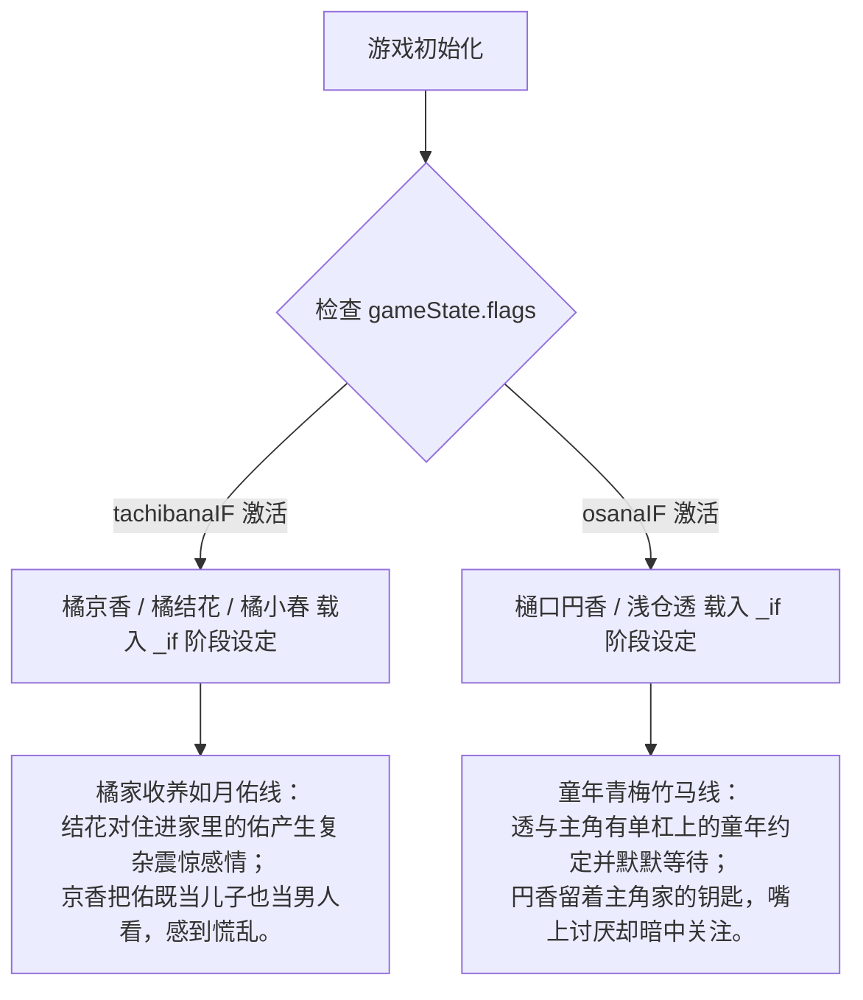

# Earth-0 游戏规则、题材定制与角色转换指南

为了防止以后忘记如何操作或向大模型解释本系统的运作方式，本指南详细总结了游戏的**运行规则**、**题材替换指南**、**世界书角色转换步骤**、**时空一致性审计**以及 **IF线机制**。

---

## 1. 游戏游玩与运行规则

本引擎遵循 **“入口宽，核心严”** 的设计原则。大语言模型（LLM/GM）负责叙事和扮演即兴的游戏主持人，而引擎层负责做物理、经济和状态的不变量校验（会计层）。

### 核心物理规则（引擎层强制执行）
* **六维属性与调整值**：力量 (STR)、敏捷 (DEX)、体质 (CON)、智力 (INT)、感知 (WIS)、魅力 (CHA)。范围 `1-20`。调整值公式为：`调整值 = (属性值 - 10) / 2`。
* **D20 骰子检定**：通用判定公式为 `d20 + 属性调整值 + 技能等级`。
  * **难度等级 (DC)**：简单 (8) / 普通 (12) / 困难 (16) / 极难 (20) / 不可能 (25)。
  * **规则**：天然 20 为大成功，天然 1 为大失败。相差超过 10 级为碾压，不进行掷骰判定。优势取双骰高值，劣势取低值。
* **战斗系统**：命中判定为 `d20 + 格斗Lv + 敏捷/力量调整值 >= 目标AC`。伤害为 `武器骰 + 力量调整值 - 护甲减伤`。HP归零进入死亡豁免（3次成功稳定，3次失败死亡）。
* **时间与年龄推进**：NPC 年龄并不是写死的，而是使用**相对年龄锚定法**，NPC 实际年龄 = `base_age + (player.age - timeline_origin.age)`。当玩家年龄增长，所有 NPC 年龄同步增长，并在 `buildStatePrompt()` 中自动加载对应年龄段的身材和性格描述。
* **经济系统**：大模型可以通过 `/look` 查看商品，但交易必须调用 `buy_item` 和 `sell_item` 工具。价格需在 `data/economy.json` 的合理价格区间内。

### 工具和状态约束位置
* **全局世界规则**：[world_rules.json](file:///c:/Users/Xiang/Documents/GitHub/基于pi-mono的手机终端airp游戏的agent化尝试/earth-0/data/world_rules.json)
* **GM大模型硬规则约束**：[gm-rules.md](file:///c:/Users/Xiang/Documents/GitHub/基于pi-mono的手机终端airp游戏的agent化尝试/earth-0/agents/gm-rules.md)
* **GM输出格式约束（禁令门）**：[gm-contract.md](file:///c:/Users/Xiang/Documents/GitHub/基于pi-mono的手机终端airp游戏的agent化尝试/earth-0/agents/gm-contract.md)

---

## 2. 换题材或加东西要修改哪些文件？

如果你想更换整个游戏的题材（例如从“春物+日常”换成“咒术回战”、“废土探索”或“异世界”），或者加入大量新内容，你需要改动以下文件（**引擎核心逻辑无需修改，全部通过 `data/` 进行解耦**）：

```
earth-0/
├── data/                             # 数据配置层（全数据解耦，换题材的核心）
│   ├── characters.json               # 1. 角色基础属性、装备、三围、初始位置和锚点
│   ├── character_stages.json         # 2. 角色按不同年龄段（幼小/中学/高中/成年）的性格描述
│   ├── rooms.json                    # 3. 房间地图格（位置、地形、家具、通道）
│   ├── regions.json                  # 4. 区域大地图（如总武高、住宅区）以及人流上限/分流备用房
│   ├── schedule_templates.json       # 5. NPC 日程行为模版（如学生、上班族、店员）
│   ├── items.json                    # 6. 世界可用物品名录、重量、攻击力、插槽
│   ├── title_rules.json              # 7. 称号解锁规则（例如魅力>=16获得“校园偶像”）
│   ├── economy.json                  # 8. 打工时薪以及物品类型的价格限制
│   ├── nameless_npc_templates.json   # 9. 公共场所自动刷出的路人（Nameless NPC）特征和刷新点
│   └── world_rules.json              # 10. 给大模型看的宏观世界规则简报
│
└── agents/                           # 提示词拼装层
    ├── preset.json                   # 提示词图层组装配置文件
    ├── gm-pre.md                     # 新世界观与核心原则描述
    ├── gm-rules.md                   # 玩法硬规则（如更换战斗为“咒力”在此修改）
    └── gm-mode-*.md                  # 不同游玩模式（GAL/RPG/SEX）下的叙事倾向
```

---

## 3. 如何从酒馆世界书（`💾⭐动漫角色百科.json`）完整转换一个角色？

以下是从 SillyTavern 世界书中提取并添加一个角色到 Earth-0 引擎的步骤指南。

### 第一步：定位世界书中的角色词条
打开 `💾⭐动漫角色百科.json`，找到 `"disable": false`（处于激活状态）的角色条目。
> [!IMPORTANT]
> 必须忽略所有 `"disable": true` 的条目。
> 提取其 `comment` 确认名字（例如：`O女角色:椎名詩織`），读取 `content` 中的 `<character>` 标签。

### 第二步：配置 `data/characters.json`（静态身材与属性）
在 `data/characters.json` 中添加一个 JSON 对象。模板如下：

```json
{
  "name": "椎名詩織",
  "source": "作品名或原创",
  "base_age": 26,                            // 数据库锚定年龄（玩家在16岁时该角色的相对年龄）
  "gender": "female",
  "appearance_brief": "一句话外观特征",
  "body": {                                  // 默认身体数据（成年/最大年龄）
    "height_cm": 173,
    "weight_kg": 58,
    "build": "丰满",
    "cup": "J",
    "measurements": { "bust": 105, "waist": 62, "hips": 95 },
    "leg_type": "肉感",
    "body_shape": { "chest": "纺锤", "hips": "蜜桃", "waist": "细腰" },
    "skin": { "base_tone": "白皙", "tan": 8, "texture": "细腻" }
  },
  "body_by_age": {                           // 【核心】不同年龄的身体变化（引擎会自动根据当前年龄在此处匹配）
    "12": { "height_cm": 155, "cup": "C", ... },
    "16": { "height_cm": 169, "cup": "G", ... },
    "20": { "height_cm": 173, "cup": "J", ... }
  },
  "attributes": { "力量": 4, "敏捷": 4, "体质": 5, "智力": 8, "感知": 10, "魅力": 12 }, // Dnd 六维
  "skills": { "口才": 5 },
  "hp": { "current": 11, "max": 11 },
  "equipment": {                             // 初始身上穿的衣物，对应 slots 
    "top": { "name": "居家针织衫", "type": "clothing", "slot": "top", "weight": 0.3, "state": "intact" }
  },
  "inventory": [],                           // 背包内的随身物品
  "default_location": "住宅区",              // 初始出生地点，必须在 regions.json 里有定义
  "sex_profile": "椎名詩織",                 // 关联 data/sex_profiles.json 中的性爱性格
  "schedule_group": "自由人",                // 绑定的日程模版
  "anchors": {
    "private": "长期的背景设定概要（在 /look 中被玩家可见，但尽量避免未来剧情剧透）"
  }
}
```

### 第三步：配置 `data/character_stages.json`（年龄段描述）
在 `data/character_stages.json` 中为该角色配置不同时期的性格描述。大模型（GM）在当前场景只会读取当前年龄对应段落的文字，绝不剧透未来信息。

```json
  "椎名詩織": {
    "幼儿_小学": "高个子女孩...曾因身高自卑...",
    "中学": "发育比同龄人早...开始练瑜伽...",
    "高中": "兼职平面模特，有点天然呆，虽然有魅力但不炫耀...",
    "成年": "已婚太太。半隐退模特，重心在家庭，极有教养的名媛印象..."
  }
```

### 第四步：配置服装卡（可选但推荐）

在 `characters.json` 的角色条目中添加 `outfits` 字段。引擎自动按场景切换并注入 prompt。无 outfits 时回退到 `appearance_brief`。

```json
"outfits": {
  "school": { "top": "总武高制服", "bottom": "黑白百褶裙", "legs": "黑色过膝袜", "feet": "皮鞋", "inner_top": "白色蕾丝胸罩", "inner_bot": "白色棉内裤" },
  "pe":     { "top": "白色体操服", "bottom": "深蓝运动短裤", "feet": "运动鞋", "inner_top": "运动内衣", "inner_bot": "白色棉内裤" },
  "swim":   { "top": "白色连体泳衣", "feet": "拖鞋" },
  "casual": { "top": "米色针织衫", "bottom": "深蓝A字裙", "feet": "棕色短靴", "inner_top": "淡蓝蕾丝胸罩", "inner_bot": "淡蓝蕾丝内裤" },
  "sleep":  { "top": "白色棉质睡裙" }
}
```

**服装卡规则：**
- 5 个固定 key：`school` / `pe` / `swim` / `casual` / `sleep`
- 每个 key 下是 `{ 槽位: "物品描述" }` 的 map
- `inner_` 前缀的槽位（如 `inner_top`）= 内层，sex 模式才展开
- 槽位名自由——`top`/`bottom`/`feet`/`acc`/`head` 均可，引擎只做分层渲染
- LLM 通过 `set_npc_outfit(角色名, key)` 切换，引擎自动注入当前外观

---

## 4. 时空一致性审计与修复报告

针对系统中可能存在的“吃书”、“未来人剧透”等年龄/时间混乱问题，我们完成了全面排查，并进行了热修复：

### 已发现并修复的冲突

1. **椎名詩織 (Shiina Shiori) 基础年龄错误 [已修复]**
   * **冲突**：世界书明确设定为 **26岁** 已婚人妻模特。但在 `characters.json` 中其 `base_age` 被设为了 **16**。导致玩家16岁（开局）时她也只有16岁，是一名“已婚的女高中生”，和她的私有背景中“丈夫常出差”逻辑直接相悖。
   * **修复**：在 `characters.json` 中将她的 `base_age` 修正为 **26**。她开局将处于 **26岁（成年阶段）**，完美对齐已婚人妻身份。
2. **雪之下绫乃 (Mrs. Yukinoshita) 母亲年龄荒谬 [已修复]**
   * **冲突**：她是雪乃（16岁）和阳乃（19岁）的母亲。但在 `characters.json` 中其 `base_age` 被错设为 **26**。这意味着她生下大女儿阳乃时年仅 **7岁**，严重违背生理常识。
   * **修复**：将她的 `base_age` 修正为 **42**。开局以 42 岁的成熟主母形象登场，年龄关系恢复正常。
3. **时空年龄推进公式回归 (Regression) [已修复]**
   * **冲突**：上一个版本中，`getNpcCurrentAge` 被硬编码修改为了 `player.age - 16`。如果玩家更换了起始年龄不是 16 的题材，NPC 年龄差将彻底崩溃（这属于调试残留的 Bug）。
   * **修复**：还原为了根据 timeline_origin 相对年龄锚定的公式：
     `const ageDelta = gameState.player.age - (gameState.time?.timeline_origin?.age ?? 16);`

### 隔离与提示机制

* **橘结花 (Tachibana Yuka) & 橘小春 (Tachibana Koharu)**
  * **分析**：虽然在 `characters.json` 的 `anchors.private` 字段里写有“后来对住进家里的佑产生了复杂的感情”等未来事件，但这个字段**并不被大模型（GM）所读取**，只有玩家主动使用 `/look` 指令时才会显示该背景摘要。
  * **结论**：在实际游玩中，当结花和小春只有 10 岁（小学阶段）时，引擎只会把 `character_stages.json` 里的 `"幼儿_小学"` 描述（纯粹的 10 岁人设）喂给大模型，因此**大模型绝不会表现出任何超前和剧透行为**。

---

## 5. 橘家、如月家及樋口/透的 IF 线设计

引擎内部目前有两组独立的 IF 线逻辑，主要通过 `gameState.flags` 中的特定标志激活，并自动切换 `character_stages.json` 中对应的 `_if` 版本阶段描述：



### 1. 橘家 IF 线 (`flags.tachibanaIF` = `true`)
* **涉及角色**：`橘京香`、`橘结花`、`橘小春`。
* **激活逻辑**：如果在存档的 flags 中激活了 `tachibanaIF`，引擎会将她们在 `character_stages.json` 里的描述动态替换成 `橘结花_if`、`橘小春_if` 和 `橘京香_if`。
* **剧情效果**：
  * 京香会收养失去父母的远亲“如月佑”（如月家二男），在抚养佑的过程中逐渐对佑产生母性与异性交织的慌乱情感。
  * 结花从抗拒、愤怒到逐渐对住进家里的佑产生复杂的依存感。
  * 小春对佑充满好奇，并在懵懂中融入了这种亲密关系。

### 2. 青梅竹马 IF 线 (`flags.osanaIF` = `true`)
* **涉及角色**：`樋口円香`、`浅仓透`。
* **激活逻辑**：flags 中激活 `osanaIF`。加载 `樋口円香_if` 和 `浅仓透_if`。
* **剧情效果**：
  * 在这条线中，主角（玩家）、円香和透在童年时期是形影不离的“三人组”。
  * 透心里深藏着童年和主角一起爬单杠的誓言，即使长大后见面变少，她仍在安静地等待主角主动记起。
  * 円香至今依然保留着主角家里的备用钥匙从没归还过，虽然青春期刻意疏远且态度冷淡，但内心依然在暗中注视着主角。

### 3. 如月家 IF 线说明
* **分析**：如月家没有直接的 `_if` 后缀阶段描述（在 `character_stages.json` 中没有 `如月真绫_if`）。
* **结论**：如月家的剧情改变是通过**事件和角色联动**完成的（不需要专门的代码切换描述）。在故事线中，二哥”如月佑”的父母双亡以及被橘家收养，是两家发生交集并激活 `tachibanaIF` 的核心剧情推手，而真绫的日常也会相应与橘家产生交错。

---

## 6. NPC 场景服装卡系统

NPC 支持**5 套场景服装**，LLM 可通过 `set_npc_outfit` 工具切换。引擎自动注入当前外观到叙述上下文。

### 服装卡定义（在 `characters.json`）

```json
“outfits”: {
  “school”: { “top”: “总武高制服”, “bottom”: “黑白百褶裙”, “legs”: “黑色过膝袜”, “feet”: “皮鞋”, “inner_top”: “白色蕾丝胸罩”, “inner_bot”: “白色棉内裤” },
  “pe”:     { “top”: “白色体操服”, “bottom”: “深蓝运动短裤”, “feet”: “运动鞋”, “inner_top”: “运动内衣”, “inner_bot”: “白色棉内裤” },
  “swim”:   { “top”: “白色连体泳衣”, “feet”: “拖鞋” },
  “casual”: { “top”: “米色针织衫”, “bottom”: “深蓝A字裙”, “feet”: “棕色短靴”, “inner_top”: “淡蓝蕾丝胸罩”, “inner_bot”: “淡蓝蕾丝内裤” },
  “sleep”:  { “top”: “白色棉质睡裙” }
}
```

### LLM 工具：`set_npc_outfit`

- **参数**：`npc` (角色名) + `outfit` (服装卡: school/pe/swim/casual/sleep)
- **效果**：引擎记录当前服装，下次 `buildStatePrompt` 自动注入新外观
- **持久化**：保存在 session.json，跨会话保持

### 注入格式

```
[NPC·外观] 总武高制服、黑白百褶裙、皮鞋。内: 白色蕾丝胸罩、白色棉内裤（黑长直、蓝色眼睛...）
```

- `inner_` 前缀的槽位 → 内层（正常模式只外层可见，sex 模式展开内层）
- 括号内为 `appearance_brief` 兜底的不变视觉特征
- 装备槽被移除/偷走 → 标记「已被拿走」

### 换装流程示例

```
体育课 → set_npc_outfit(“雪之下雪乃”, “pe”)
游泳课 → set_npc_outfit(“雪之下雪乃”, “swim”)
放学后 → set_npc_outfit(“雪之下雪乃”, “school”)
周末逛街 → set_npc_outfit(“雪之下雪乃”, “casual”)
```

如需新服装卡（如 “date”/”party”/”winter”），直接在 characters.json 的 outfits 对象里加 key 即可。

---

## 7. 玩家穿着注入

引擎自动将玩家当前装备槽注入 prompt：

```
[穿着] 总武高制服、牛仔裤、运动鞋        ← 日常只注外层
[穿着] 总武高制服、牛仔裤  |  内: 胸罩、内裤 ← sex 模式展开内层
[穿着] （什么都没穿）                    ← 全裸
```

- `inner_top` / `inner_bot` 槽位 = 内层
- 其他槽位 = 外层
- LLM 每一轮都能看到玩家穿了什么

---

## 8. 装备效果系统（已接线）

装备的 `effects` 数组驱动所有机械加成。以下是完整的接线清单：

| effect 类型 | 生效位置 | 示例 |
|------------|---------|------|
| `attribute_bonus` | 战斗攻击、偷窃、身份检定 | 运动服 → 敏捷+1 |
| `social_bonus` | 身份检定（校内） | 制服 → 校内社交+1 |
| `reputation_bonus` | 声望计算 | 制服 → 学生声望+1 |
| `damage_reduction` | 战斗减伤 | 厚外套 → 钝击-1 |
| `ac_bonus` | AC 计算 | 护甲 → 防御提升 |
| `disguise_tag` | 身份伪装 | 制服 → 「你被认知为: 总武高学生」 |
| `cold_resist` | 寒冷天气提示 | 厚外套 → 温度<5°C 注入保暖描述 |
| `pocket` | 容器容积 | 书包 → 背包 +15L |
| `heal` | `use_item` 工具 | 绷带 → `1d4` HP，饭团 → `1` HP |
| `energy` | `use_item` 工具 | MAX COFFEE → 提神效果 |

### NPC 装备效果补充

NPC 初始装备从 `characters.json` 定义，引擎在 `getOrCreateNPC` 时自动从 `items.json` 匹配同名物品补全 effects。**偷 NPC 的装备穿上 = 有效果，不是空壳。**

---

## 9. 新增 LLM 工具速查表

本日新增的工具（截至 2026-06-16）：

| 工具 | 用途 |
|------|------|
| `use_item` | 使用背包中的消耗品（heal 回血 / energy 提神），物品消耗后消失 |
| `set_npc_outfit` | 切换 NPC 场景服装卡（school/pe/swim/casual/sleep） |

### 房间时间戳脏污

引擎自动记录每个房间的最后访问时间。距上次访问 > 4 天时注入氛围描述：

| 天数 | 描述 |
|------|------|
| 4-14 | 「有一阵子没人来了」 |
| 15-30 | 「角落结了蛛网，空气里有股久置的气味」 |
| 30+ | 「灰尘覆盖了一切——这里像是被遗忘了」 |

纯引擎生成，0 token 调用 LLM。触发于 `moveTo` / `commit_turn` / `settle_scene`。

### 场景 sex 氛围

sex 模式下，引擎利用房间的 `atmosphere` / `ambient` 字段注入环境叙事：
```
[环境·亲密] 狭小的部室，只有老旧暖炉的嗡嗡声和窗外操场的喧闹。
```

若房间无 atmosphere 数据，按房间名匹配 10 种默认亲密氛围。
